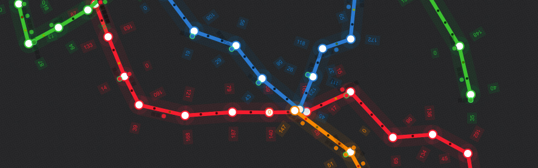

# Subway

A metro/subway flow simulation.

[Demo](https://subway-singuerinc.netlify.com/)

## About

I am quiet a fan of transportation systems. I used to play a lot to [OpenTTD](https://www.openttd.org/en/): an open source version of [Transport Tycoon](https://en.wikipedia.org/wiki/Transport_Tycoon).

I was always fascinated by the (almost) perfect synchronization that the train systems have.

## Logic

A few statements about this experiment:

- There is no API connected to the app: I was considering the idea of using an API to get the data, but the problem is that it becomes a "visualization" rather than a simulation.

- It is based on the Barcelona subway net, but can be easely modified to display any system.

- It includes a simple "AI":

    - Trains unload and load cargo on each station
    - Trains decide when to wait or enter to a waypoint/station by status (free/occupied)
    - Trains have a predefined itinerary and routes that have to follow
    - Stations get cargo (passengers) to be delivered to other stations
    - Trains have different capacity (1, 2, 3 or more wagons)
    - Trains max speed is affected by the cargo and the size of the train
    - Trains may have failures (not yet implemented)

## Tech

I created this project as a fun way to learn a bit more about [Typescript](https://www.typescriptlang.org/) and [PIXI.js](http://www.pixijs.com/)

## Other cities

The simulation is fixed to display the Barcelona subway, but it is very easy to change to any city, you just need to define a Subway line and the coords for each station. Take a look the `src/lines` folder.

## License

See the [LICENSE](LICENSE.md) file for license rights and limitations (MIT).
